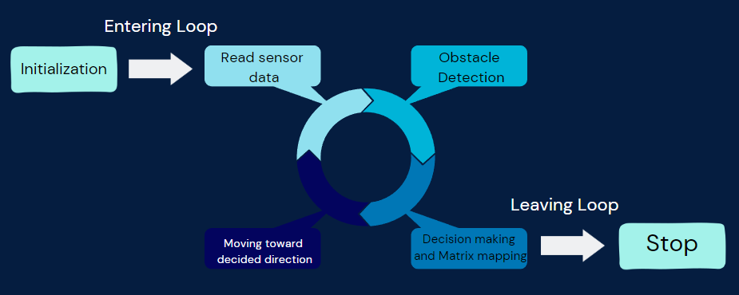

# Mobile Robot Map Generator

## Description

This mobile robot is a map generator designed to scan a real 2D map and draw it on an LED matrix. The project was developed as part of a school project in collaboration with a group. 

## Components

- Arduino Uno
- Motor Driver
- Ultrasonic Sensor
- Batteries
- Gear Motors
- Wheels
- Servo Motor
- LED Matrix

## Functioning

When enabled, the mobile robot moves through the map. Whenever it detects an obstacle using its ultrasonic sensor, it avoids it and also marks its position on the LED matrix as an obstacle. 

In the LED matrix:
- A LED that is turned on indicates that the corresponding block in the real map contains an obstacle.

Note: Each \( x \times x \) block in the real map is represented by a single LED, where \( x \) is a constant defined in the code.

The following figure explains the algorithm functioning:

## Limitations

The robot is still in its initial phase and has several limitations:

- **Sensor Limitations**: The sensing is not very precise, especially at larger distances.
- **Non-Edge Detection**: The robot is unable to detect obstacles at its edges.
- **Not Trained on Complex Maps**: The robot can only map simple maps, such as rectangular maps. When used in more complex maps, like mazes, it may provide incorrect outputs and could get blocked.
- **Code Quality**: The code is not clean and may require optimization.

## Future Improvements

Some potential future improvements include:

- Making the robot functional in non-square map environments.
- Optimizing the algorithm by adding path remembering techniques, energy consumption optimization, and speed monitoring.
- Using infrared sensors and dual sensors to avoid problems at the edges.
- Considering the use of a PID controller.

We invite anyone interested to collaborate on these improvements. For now, we have no plans to make further improvements to this project as it is not of great importance.